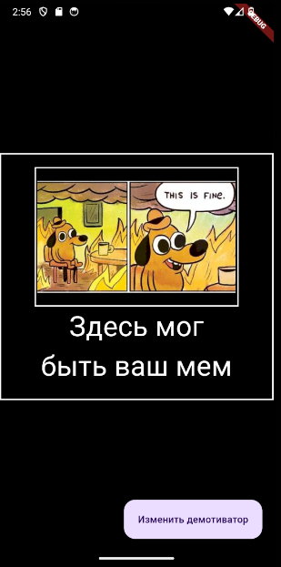
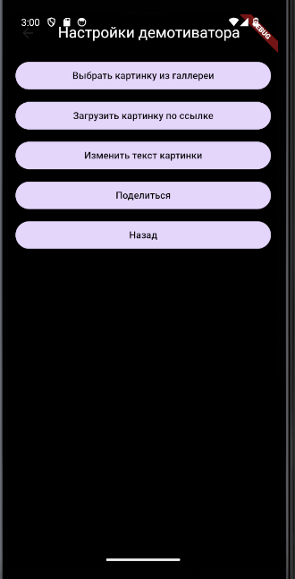
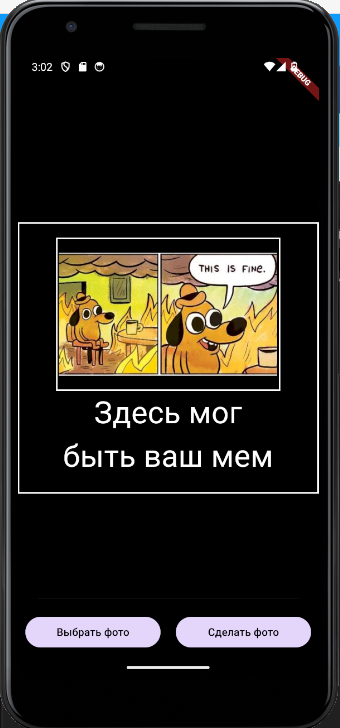
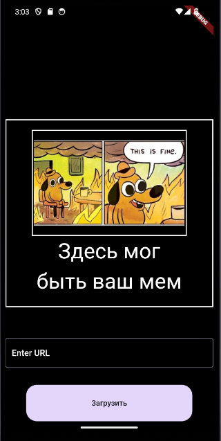
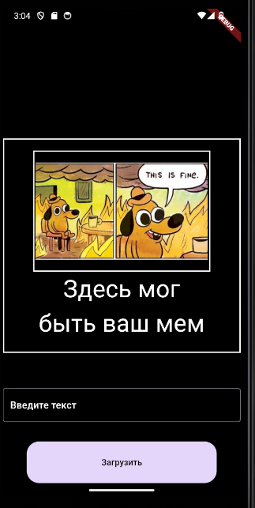
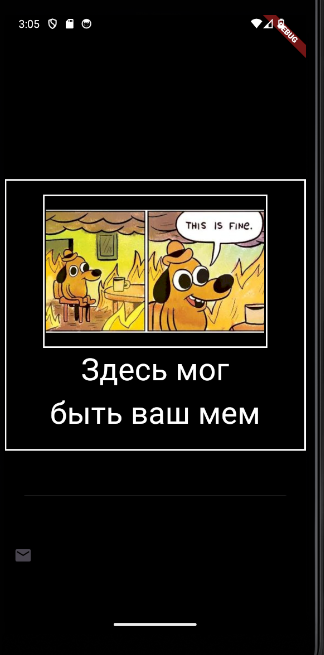

# Генератор демотиваторов

## Описание фичи

Однажды, проснувшись, вы почувствовали, что хотите сделать мир вокруг вас лучше. Сделать свой вклад в развитие человечества. И тут вы вспомнили, что у вас есть знания Flutter и вы можете сделать приложение, которое поможет людям. И вот вы здесь. Чтобы написать приложение, которое позволяет генерировать мемы.

## Результат работы

На главном экране находится мем в текущем его состоянии.

Для открытия меню взаимодействия можно нажать на текст, изображение или кнопу в правом нижнем углу. После этого снизу плавно выедет меню настроект демотиватора.

После нажатия на кнопку меню настроек скрывается и выезжает соответствующий функции модуль.

Реализован и доступен следующий функционал:

1. Выбор картинки из галереи(идет подразделение на выбор из галереи и моментальное фото)

2. Загрузка картинки из сети по ссылке

3. Изменение текста картинки

4. Поделиться(делается скриншот виджета с мемом и отправляется по почте)

5. Кнопка возврата на главный экран. Это не единственный способ вернуться назад - с помощью свайпа вниз можно убрать окно настроек и любой функциональный модуль

Во время смены картинки отображается колесико загрузки, в случае неудачи- соответствующий текст.
